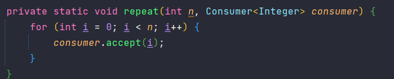

## Interfaces

* Ao utilizarmos Lambda Expressions é necessário usar uma Functional Interface, porém podemos utilizar um série de interfaces já prontas ao invés de criá-las;

### Consumer
* Recebe um único parâmetro e não retorna nada;
* 