## Interfaces

* Ao utilizarmos Lambda Expressions é necessário usar uma Functional Interface, porém podemos utilizar um série de interfaces já prontas ao invés de criá-las;

### Consumer
* Recebe um único parâmetro e não retorna nada;
* Estrutura:
  - 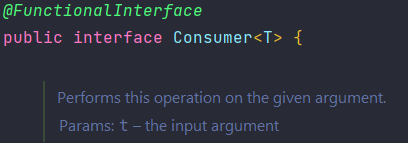
* Exemplo:
  - 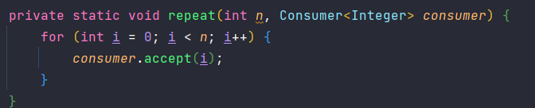

### BiConsumer
* Recebe dois parâmetros, de tipos diferentes, e não retorna nada;
* Estrutura:
  - 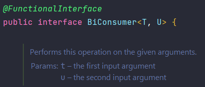
* Exemplo:
  - 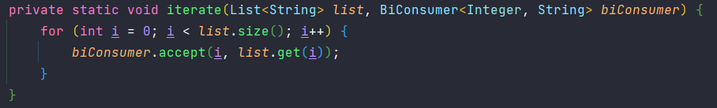

### Predicate
* Recebe um parâmetro e retorna um boolean;
* Estrutura:
  - 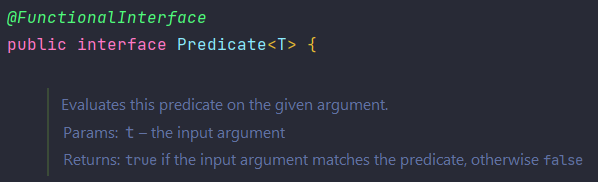
* Exemplo: 
  - 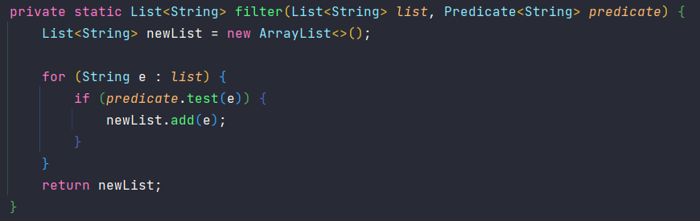

### Function
* Recebe um parâmetro de um tipo e retorna de outro (pode ser o mesmo, ou não);
* Muito utilizada quando precisamos mapear tipos de dados;
* Estrutura:
  - 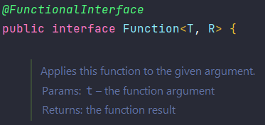
* Exemplo:
  - 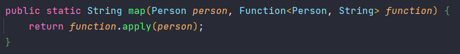

### BiFunction
* Recebe dois parâmetros de entrada com um retorno;
* É como se combinassem os dois parâmetros para um retorno único;
* Estrutura: 
  - 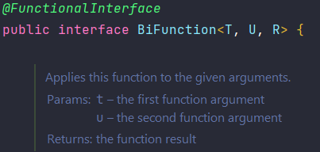
* Exemplo:
  - 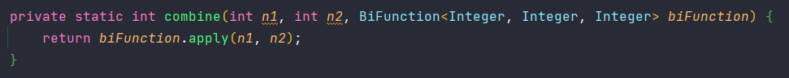

### Supplier
* Apenas retorna algo, por isso possui apenas o método get();
* Funciona como um provedor de informação;
* Estrutura:
  - 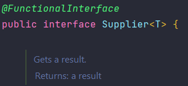
* Exemplo: 
  - 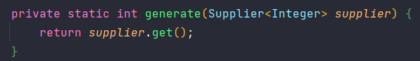

### Runnable
* Não retorna nada e nem recebe parâmetros;
* Possui apenas o método run();
* Utilizado quando queremos usar uma Lambda Expression sem parâmetros, com o único objetivo de executar um bloco de código;