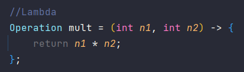
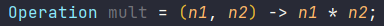
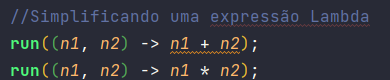
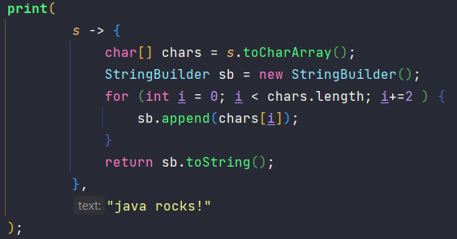
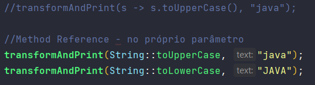
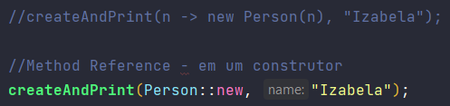
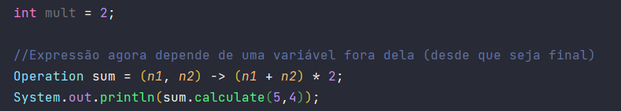

# Lambda Expressions

- Utilizam o paradigma de programação funcional (focada em funções que podem ser utilizadas como parâmetros e retornadas);
- O conceitos de Lambda Expressions são baseados nas Anonymous Inner Classes;
- Sempre que temos uma Anonymous Inner Class de uma interface que implementa um método (apenas um, ou seja, uma Functional interface), podemos transformá-la em uma Lambda Expression;
- Estrutura: nome = (parâmetros) -> {corpo};
- 
- Para simplificar ainda mais podemos:
  - omitir o tipo dos dados (se não houber ambiguidade);
  - remover o return e as chaves, se houver apenas uma linha de código;
  - 
  - 

- Podemos usar Lambda Expressions como parâmetros:
- 

### Method Reference

- Usado quando a lambda expression tem apenas uma linha de código e na sua execução o parâmetro é usado;
- Oculta-se o parâmetro;
- 
- Também pode ser usado em um construtor:
- 

### Closures

- Lambda Expression que não depende apenas dos parâmetros que ela recebe, mas também, de uma variável definida fora dela;
- 
- Quando uma Lambda Expression usa um atributo e não uma variável local, a mesma pode ser alterada, não é preciso ser final;

