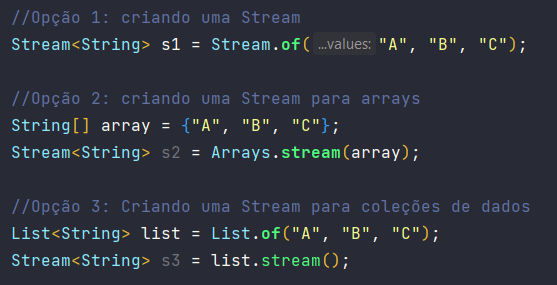

# :memo: Stream API

- Source: serão grupos de informações que serão transformadas através de operações.
- Possuem dois tipos de operações:
  - Operação  intermediária: é uma operação executada em uma stream que produz outra stream;
  - Operação terminal: fecha a stream produzindo os dados finais.
- Streams nunca modificam a fonte dos dados;
- Uma operação apenas será completamente executada quando executamos uma operção terminal, fazendo com que a Stream API seja extremamente eficiente.

### :pushpin: Estrutura:

- 