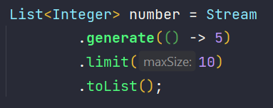

# :memo: Stream API

- Source: serão grupos de informações que serão transformadas através de operações.
- Possuem dois tipos de operações:
  - Operação  intermediária: é uma operação executada em uma stream que produz outra stream;
  - Operação terminal: fecha a stream produzindo os dados finais.
- Streams nunca modificam a fonte dos dados;
- Uma operação apenas será completamente executada quando executamos uma operção terminal, fazendo com que a Stream API seja extremamente eficiente.

### :pushpin: Estrutura:

- 

### :pushpin: Métodos:
- map(função) : para mapear os dados.
- filter(predicate) : filtar os dados.
- sorted(Comparator): para ordernar os dados.

- 

- mapToInt(): para transformar uma stream em uma IntStream.
- max() : para encontrar o maior valor.
- min() : para encontrar o menor valor.
- average() :  encontra a média dos valores.
- 

- toList() : é uma operação final para coletar os elementos da stream.
- 

- Outra forma de criar Streams é através do método generate():
  - Gera uma stream infinta, portanto temos que limitá-la.
  - É bastante utilizado quando queremos gerar vários números constantes ou aleatórios.
  - 