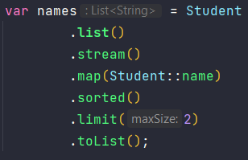

# :memo: Stream API

- Source: serão grupos de informações que serão transformadas através de operações.
- Possuem dois tipos de operações:
  - Operação  intermediária: é uma operação executada em uma stream que produz outra stream;
  - Operação terminal: fecha a stream produzindo os dados finais.
- Streams nunca modificam a fonte dos dados;
- Uma operação apenas será completamente executada quando executamos uma operção terminal, fazendo com que a Stream API seja extremamente eficiente.

### :pushpin: Estrutura:

- 

### :pushpin: Métodos:
- map(função) : para mapear os dados.
- filter(predicate) : filtar os dados.
- sorted(Comparator): para ordernar os dados.

- 

- mapToInt(): para transformar uma stream em uma IntStream.
- max() : para encontrar o maior valor.
- min() : para encontrar o menor valor.
- average() :  encontra a média dos valores.
- 

- toList() : é uma operação final para coletar os elementos da stream.
- 

- Outra forma de criar Streams é através do método generate():
  - Gera uma stream infinta, portanto temos que limitá-la.
  - É bastante utilizado quando queremos gerar vários números constantes ou aleatórios.
  - 

- Para gerar uma Stream de números aleatórios:
- Podemos usar os métodos ints(), doubles(), longs(), etc.
- 

### :pushpin: Operações Intermediárias:

- map(Function) : transformar uma coisa em outra;
- mapToInt() : para trabalhar com tipos primitivos (quando utilizá-los, precisamos to toArray() ao invés de toList());
- 
- flatMap(Function) : o retorno dele deve ser uma Stream (junta a Stream de saída com a Stream atual) - > quando trabalhamos com uma lista dentro de outra lista.
- 
- filter(Predicate) : para filtrar uma informação.
- 
- distinct() : remove todos os elementos duplicados. Não recebe parâmetro e retorna uma nova stream.
- 
- sorted() :  ordena os elementos de acordo com a ordem natural. Caso queira ordenar de outra forma, devemos colocar como parâmetro o comparator.
- 
- limit(numMaxEl) :  permite criarmos uma Stream limitando o número de elementos.
- 
- peek(Consumer) : muito utilizada durante operações de debug. Permite visualizar o andamento do código.